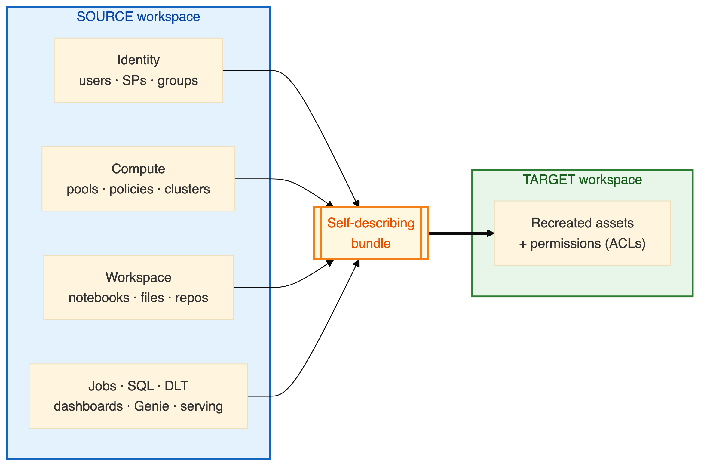

# 🚚 Workspace Migration Utility

> A **notebook-based**, **config-driven** utility that migrates **all non‑UC workspace
> assets** from a **source** Databricks workspace to a **target** workspace — built to run
> **entirely inside Databricks** (no terminal, no local Python) and to migrate **100+
> workspace pairs** with the same code.

<p>


</p>

---

## 📖 Documentation

**👉 Start at the [Documentation Hub](docs/README.md).** Then pick your path:

| Guide | What it covers | Read it if you… |
|-------|----------------|-----------------|
| 🏗️ **[Architecture & Working Model](docs/ARCHITECTURE.md)** | How migration works end-to-end; `airgap` vs `direct`; the bundle; dependency order | …want to understand *how* it works |
| ⚙️ **[Configuration Guide](docs/CONFIGURATION_GUIDE.md)** | Every widget & config option, with defaults and examples | …are filling in widgets / job params |
| 📋 **[Runbook](docs/RUNBOOK.md)** | Crystal-clear, step-by-step instructions for a real migration | …are about to run a migration |
| 🔐 **[Permissions Guide](docs/PERMISSIONS_GUIDE.md)** | Exact permissions per mode; the minimum a customer must grant | …need to request access first |

---

## 🎯 Summary

Migrates non‑UC workspace assets from a source workspace to a target workspace on the **same
cloud, across regions (Azure region → Azure region)**:



It is **idempotent** and **incremental**: every asset is UPSERTed against a Delta state table,
so the *same pair can be re-run many times* — new assets are **created**, changed assets
**updated**, unchanged assets **skipped**, and deletions **reported** (never auto-deleted by
default).

> ⚠️ **Out of scope:** Unity Catalog assets, Hive metastore, MLflow, Agent Bricks agents, PATs,
> and IP access lists. Full scope table → [Architecture › Scope](docs/ARCHITECTURE.md#-scope--what-is-and-isnt-migrated).

## 🔀 Two connectivity modes

| Mode | Where stages run | How the source is read | The file hop |
|------|------------------|------------------------|--------------|
| **`direct`** *(default)* | Every stage runs in the **target** | Reads source over REST via a source workspace-admin **SP (OAuth M2M)** | **None** — one end-to-end Job |
| **`airgap`** | `01`/`02` in **source**, `04` in **target** | Runs *inside* the source workspace | Ops **physically moves** the bundle between staging locations |

Both modes produce the **identical bundle**, so import is mode-agnostic. Details →
[Architecture › The two modes](docs/ARCHITECTURE.md#-the-two-connectivity-modes).

## 🚀 The notebooks

| Notebook | Stage | Runs in |
|----------|-------|---------|
| `notebooks/01_Inventory.py` | Read-only enumeration + identity classification | Source *(airgap)* / Target *(direct)* |
| `notebooks/02_Export.py` | Dump enabled assets → staging **bundle** + manifest | Source *(airgap)* / Target *(direct)* |
| `notebooks/04_Import.py` | Preflight → create/update on target, in dependency order | Target |
| `notebooks/00_Install_Jobs.py` | Idempotent Jobs installer (deploys `jobs/*.job.json`) | Target |

**New here? Go straight to the [Runbook](docs/RUNBOOK.md).**

## 🗂️ Repository layout

```
notebooks/   01_Inventory · 02_Export · 04_Import · 00_Install_Jobs   (thin; widgets only)
jobs/        *.job.json         Jobs API 2.2 definitions installed by 00_Install_Jobs
src/         config/  auth/  collectors/  importers/  identity/  state/
             transform/  reports/  exporters/  utils/
plans/       PLAN_0_master.md + per-feature design/review docs
docs/        this documentation set
```
