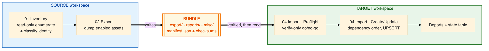
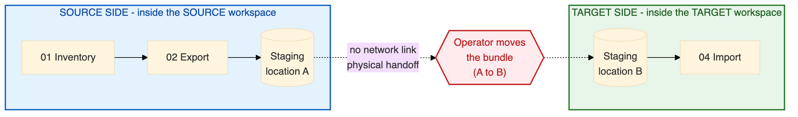
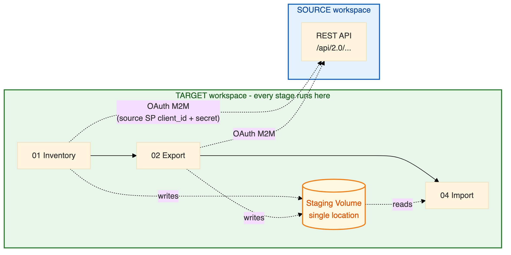
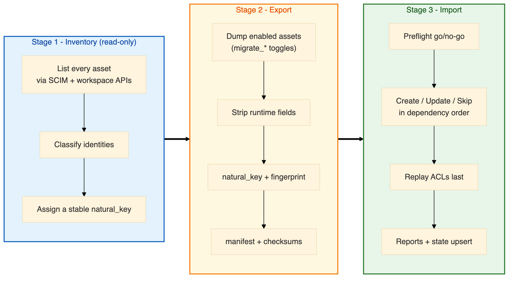
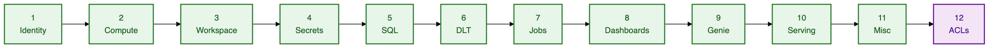
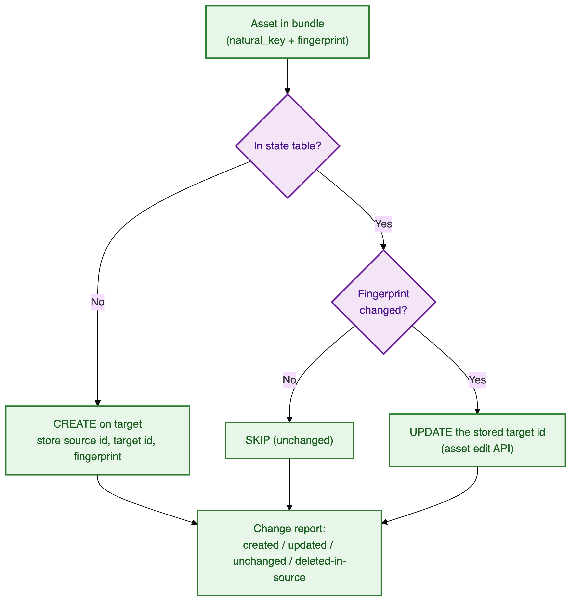
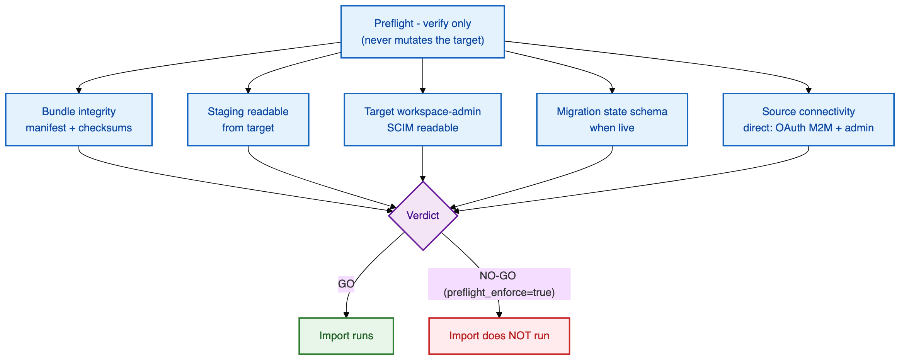
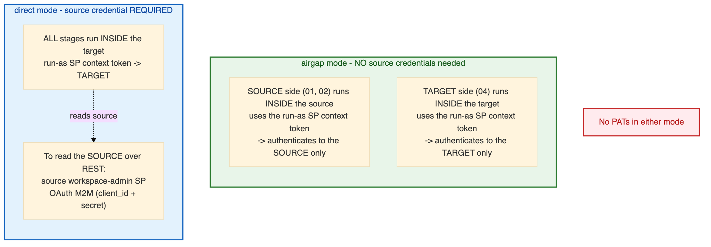

# 🏗️ Architecture & Working Model

How the Workspace Migration Utility works end-to-end, both connectivity modes, the bundle it
produces, the order it recreates assets in, and exactly what is (and isn't) migrated.

> **New to the tool?** This is the right place to start. The [Runbook](RUNBOOK.md) tells you
> *how to run it*; this document tells you *how it works*.

## 📖 Contents

1. [The big picture](#-the-big-picture)
2. [The two connectivity modes](#-the-two-connectivity-modes)
   - [Mode A — `airgap`](#mode-a--airgap-two-sided-no-connectivity)
   - [Mode B — `direct`](#mode-b--direct-default-one-sided)
   - [Side-by-side](#-side-by-side)
3. [The pipeline stages](#-the-pipeline-stages)
4. [The bundle](#-the-bundle-the-only-thing-that-moves)
5. [Asset dependency order](#-asset-dependency-order)
6. [Identity model](#-identity-model-the-core-of-this-utility)
7. [Idempotent & incremental runs](#-idempotent--incremental-runs)
8. [The preflight gate](#-the-preflight-gate)
9. [Scope — what is & isn't migrated](#-scope--what-is-and-isnt-migrated)
10. [Auth model](#-auth-model)

---

## 🔭 The big picture

The utility reads a **source** workspace, writes a portable **bundle**, and recreates those
assets on a **target** workspace — in dependency order, idempotently, with permissions replayed
last.



**Design principles:**

| Principle | What it means in practice |
|-----------|---------------------------|
| **Notebook-only** | Runs entirely inside Databricks. No terminal, no local Python, no bundled CLI. |
| **Config-driven & generic** | No customer- or workspace-specific values in code — everything is a widget / job param, so the same code migrates 100+ pairs. |
| **The bundle is the contract** | Both modes emit an identical, self-describing bundle. Import/transform never care which mode produced it. |
| **Idempotent + incremental** | Every asset is UPSERTed against a Delta state table. Re-runs are expected and safe. |
| **Fail-soft** | One asset's failure is recorded and the run continues. Only pre-write gate failures stop the run. |
| **Dry-run first** | Import defaults to a full, write-nothing rehearsal. |

---

## 🔀 The two connectivity modes

The deployment model isn't fixed, so the tool supports **two modes**, chosen by the
`connectivity_mode` widget. They differ in only two things: **who reads the source**, and
**whether the file hop is manual**.

### Mode A — `airgap` (two-sided, NO connectivity)

There is **no network path** between source and target. The tool runs on **two sides that never
talk to each other**, and a human moves the bundle between them.



- The **same Git folder** is pulled into **both** workspaces. The role is **derived** from the
  stage + mode (no `role` widget) and guards against mis-runs.
- Each side authenticates **only to its own workspace** (the run-as SP's notebook-context token).
  **No live cross-workspace REST call, ever.**
- The air-gap hop is simply "source side sets staging **location A**, target side sets staging
  **location B**" — two separate runs, each with its own single `staging_location`.

### Mode B — `direct` (default, one-sided)

**Every** stage runs **inside the target workspace**. Inventory/export reach the source over REST
using a **source workspace-admin SP's client id + secret** (OAuth M2M). The bundle is written
straight to the single staging location — **no manual hop** — so the whole migration can run as
**one end-to-end Job**.



- The SP secret is supplied **either** via a target-workspace **secret scope** (preferred —
  `source_sp_secret_scope` + `source_sp_secret_key`) **or** a widget (`spn_secret_value`, a
  fallback). It is **always redacted** from artifacts and logs.
- The workspace a notebook *runs in* (the target) is still reached with the run-as SP's
  notebook-context token; only the **source** uses OAuth M2M.

### ⚖️ Side-by-side

| Aspect | `airgap` | `direct` *(default)* |
|--------|----------|----------------------|
| **Where `01`/`02` run** | Source workspace | Target workspace |
| **Where `04` runs** | Target workspace | Target workspace |
| **Source↔target connectivity** | ❌ none (by design) | ✅ target → source over REST |
| **How source is read** | Runs inside the source | OAuth M2M with a source SP |
| **File hop** | ✅ manual (ops moves the bundle) | ❌ none |
| **Can be one Job?** | No (two sides) | ✅ yes (end-to-end) |
| **Extra credential** | none | source workspace-admin SP + secret |
| **Bundle produced** | 🟰 identical | 🟰 identical |

> 🧠 **Why it doesn't matter for import:** because both modes emit the same bundle, preflight,
> transforms, and import are 100% mode-agnostic. The mode is recorded in `manifest.json` +
> `config_resolved.json`; only `01`/`02` and the auth client builder are mode-aware.

---

## 🔧 The pipeline stages



| Stage | Notebook | Reads | Writes | Mutating? |
|-------|----------|-------|--------|-----------|
| **Inventory** | `01_Inventory` | Source workspace | Inventory JSON + report | ❌ read-only |
| **Export** | `02_Export` | Source workspace | The bundle (`export/`) + manifest | ❌ (writes staging only) |
| **Import** | `04_Import` | The bundle | Target workspace + state table | ✅ (unless `dry_run`) |

---

## 📦 The bundle (the only thing that moves)

Every run writes a **run-isolated, self-describing** directory. In `airgap` mode this bundle is
literally the only thing that crosses between workspaces.

**Layout** — under `<staging_location>/wsmig/<source_workspace_id>/<run_id>/`:

```
<staging_location>/wsmig/<source_workspace_id>/
├── LATEST_INVENTORY.json         ← pair-level pointer (above the run dir)
├── LATEST_EXPORT.json            ← pair-level pointer (above the run dir)
└── <run_id>/
    ├── export/                   ← the exported bundle — the ONLY thing airgap moves
    │   ├── identity_classification.json
    │   ├── acls.json
    │   ├── <asset JSON files>
    │   └── <notebook SOURCE / DBC content>
    ├── reports/                  ← human-facing outputs
    │   ├── *.xlsx                 (inventory, export, import status incl. ACL Parity sheet)
    │   └── manual_actions_*.md    (the operator runbook of manual steps)
    └── misc/                     ← machine / bookkeeping JSON + logs
        ├── inventory.json
        ├── export_index.json
        ├── config_resolved.json  (credentials redacted)
        ├── manifest.json         (asset list, counts, checksums, source ws id, tool version)
        ├── checkpoint.json
        ├── import_results.json
        ├── preflight_report.json
        └── execution*.log
```

> 📁 Every read/write goes through a single path registry (`src/exporters/bundle_paths.py`), so
> the layout lives in **one place**.

### What each file holds — and why it exists

| File | Folder | What it holds | Why it's there |
|------|--------|---------------|----------------|
| **`<asset>.json`** | `export/` | Per-asset create payloads (runtime fields stripped) + a stable `natural_key` and content `fingerprint` | The recreate instructions for the target; the fingerprint drives create-vs-update-vs-skip |
| **notebook `SOURCE` / `DBC`** | `export/` | The actual notebook + workspace-file content | So content, not just metadata, is recreated on the target |
| **`identity_classification.json`** | `export/` | The identity roster with each identity's kind (user / SP / group; account vs workspace-local; Entra-backed) | The target reconciles identities against this; also drives the "deleted-in-source vs not-migrated" distinction |
| **`acls.json`** | `export/` | Every object's permission grants captured on the source | Replayed in the **final** ACL phase once all id maps exist |
| **`manifest.json`** | `misc/` | Asset list, per-type counts, checksums, source ws id, tool version | Lets the target **verify a complete upload** before acting (a partial upload must never look like a partial migration) |
| **`inventory.json`** | `misc/` | The full read-only inventory from `01` | The source of truth for what exists; feeds the reports |
| **`export_index.json`** | `misc/` | Index of exported units + counts + tool version + timestamp | Bundle summary the import prints and the reports join on |
| **`config_resolved.json`** | `misc/` | The exact resolved config for the run — **credentials redacted** | Auditable record of *how* a run was configured, safe to keep |
| **`checkpoint.json`** | `misc/` | Progress markers per stage | Makes a re-run **resume** instead of restarting |
| **`import_results.json`** | `misc/` | Per-unit import outcome (action, status, note) | Machine-readable results; feeds retries and the Plan 4 reconciliation |
| **`preflight_report.json`** | `misc/` | The graded go/no-go verdict | Records why a run was allowed to proceed (or not) |
| **`*.xlsx`** | `reports/` | Human reports: inventory, export, import status (incl. the **ACL Parity** sheet) | The primary human-facing output — one sheet per asset type |
| **`manual_actions_*.md`** | `reports/` | The checklist of steps only a human can do | The operator's manual-work runbook (secret values, AKV scopes, legacy dashboards, Git repos) |
| **`execution*.log`** | `misc/` | Full execution log | Debugging + audit trail |

> **Why self-describing?** The `manifest.json` lets the target **verify the upload arrived
> complete** (counts + checksums) *before* it acts. A partial upload must never present as a
> partial migration.

---

## 🔗 Asset dependency order

Assets are created in an order that respects their dependencies. **Identity is first** (everything
that names a principal needs it) and **ACLs are always last** (a grant names both a principal *and*
an object, so it needs both id maps to exist first).



| # | Phase | Covers | Depends on |
|---|-------|--------|-----------|
| 1 | **Identity** | Users, SPs, groups (+ membership, entitlements) | — |
| 2 | **Compute** | Instance pools → cluster policies → clusters | Identity |
| 3 | **Workspace** | Directories → notebooks → files → repos | Identity |
| 4 | **Secrets** | Secret scopes + ACLs (values manual) | Identity |
| 5 | **SQL** | Warehouses, queries, alerts | Identity |
| 6 | **DLT** | Delta Live Tables pipelines | Identity, compute, workspace, **SQL** |
| 7 | **Jobs** | Jobs | Identity, compute, workspace, **SQL, DLT** |
| 8 | **Dashboards** | AI/BI (Lakeview) dashboards | SQL |
| 9 | **Genie** | Genie spaces | SQL |
| 10 | **Serving** | Model serving endpoints | Identity |
| 11 | **Misc** | Global init scripts, cluster libraries, workspace conf | Compute |
| 12 | **ACLs** ⭐ | Object permissions across everything above | **All id maps** |

> 🔀 **Why SQL and DLT come *before* jobs:** a job task can reference a SQL warehouse
> (`sql_task.warehouse_id`), a DLT pipeline (`pipeline_task.pipeline_id`), or another job
> (`run_job_task.job_id`) — so jobs *depend on* SQL and DLT, never the reverse. Creating SQL and DLT
> first means those references resolve on the **first pass** instead of failing and only healing on a
> later retry.

> The `import_assets` widget selects **which families run this session** (see the
> [Configuration Guide](CONFIGURATION_GUIDE.md#-import-selection--retries)). Selecting a family
> whose prerequisites are neither selected nor already recorded in the state table is a hard error
> that lists what's missing. `acls` is independently selectable because permission replay is the
> pass most likely to need a second attempt after identities are fixed up or a DAB redeploy lands.

---

## 👥 Identity model (the core of this utility)

Identity is the hardest part of a cross-workspace migration and the reason this tool exists
(the customer has **Databricks-managed groups** created *inside* Databricks, not via Entra/SCIM).

There are **three identity types** — **Users**, **Service principals (SPNs)**, and **Groups** — and
each can come from **three origins**: **Azure Entra** (provisioned via SCIM), **Databricks
account-level**, or **Databricks workspace-local**. What the utility does depends on the origin, not
just the type. Classification is done **source-side** (written into the bundle as
`identity_classification.json`); reconciliation + creation are **target-side**. The roster is read
from the **workspace SCIM** so we reproduce exactly the identities assigned to that workspace, and
workspace-scoped **entitlements** are captured per identity.

| Origin | Users | Service principals (SPNs) | Groups |
|--------|-------|---------------------------|--------|
| **Azure Entra**<br/>(SCIM-provisioned; carries `externalId`) | **Assign** to the target workspace + set entitlements. Same email — no new id. *(If absent from the target account, customer IT/SCIM must provision it first.)* | **Assign** by the same `applicationId` + entitlements. No new id. *(IT/SCIM provisions if absent.)* | **Assign** the account group to the target workspace + re-apply entitlements. Members stay **account-owned** (not modified). *(IT/SCIM provisions if absent.)* |
| **Databricks account-level**<br/>(created in the account, no `externalId`) | **Assign** to the target workspace + entitlements. Same id. | **Assign** by the same `applicationId` + entitlements. Same id. | **Assign** to the target workspace + entitlements. Members account-owned. |
| **Databricks workspace-local**<br/>(created inside the workspace) | *n/a — a user always lives at the account; there is no workspace-local user* | **Recreate** on target → gets a **new `applicationId`**; record an `old → new` map so ACL references remap. | **Recreate** on target → members (users / SPs / nested groups, **nested-first**) + entitlements + roles; record `old → new` id so references remap. |

**How the tool tells them apart:**

- **Users & SPNs** never need "recreating" for the Entra/account origins — a `POST` to workspace
  SCIM with the same email / `applicationId` **adopts** the existing account identity and assigns it
  (same id). Only a genuinely **workspace-local** (Databricks-managed) SP is minted fresh.
- **Groups are the one type that must be classified before any write.** The signal is the group's
  `meta.resourceType`: `WorkspaceGroup` → recreate, `Group` → account group → assign. Guessing wrong
  is unsafe — shadow an account group and you *permanently block* assigning the real one.
- **`externalId`** only tags an identity as Entra-backed (for reporting). Entra-backed and
  Databricks-native account groups take the **identical** code path.

**Detection-driven:** at runtime the tool lists what already exists on the target and only creates
or assigns what's missing — so you don't need to answer "same account or new account?" up front.

- **Same account** → account identities already exist; if SCIM already assigns them to the target
  WS, the tool skips create+assign and only sets entitlements + ACLs.
- **New account / not yet assigned** → if the running SP has **account-admin**, the tool can assign
  them (PermissionAssignments API); if only **workspace-admin**, it **detects the gap and reports it**
  as a prerequisite for customer IT rather than failing silently.

A per-pair **`identity_map`** is persisted (SP `old → new` appId, group map, user map, and a
`manual_actions` list). See the [Permissions Guide](PERMISSIONS_GUIDE.md) for the credential
implications.

---

## ♻️ Idempotent & incremental runs

The same workspace pair is migrated **many times over its life** (new jobs/pools, edited policies,
etc.). Skip-if-exists alone would silently drop *updates* — so **every asset is UPSERTed**.



- A **target-side Delta state store** (`src/state/state_store.py`) is keyed by
  `(source_ws_id, asset_type, natural_key)` and stores **both** source and target object ids **plus**
  a content fingerprint. Storing both ids lets a re-run edit the *right* target object instead of
  creating a duplicate.
- The identity `old → new` map is persisted in the state store so re-runs reuse it, not duplicate.
- Deletions in source are **reported, never auto-deleted** (unless `allow_deletes=true`).
- Table names are **owned by the tool** (`wsmig_migration_state`, `wsmig_identity_map`,
  `wsmig_migration_state_dryrun`) in one **shared catalog + schema** across all pairs, keyed by
  `source_workspace_id`. A dry run writes to a **separate** `…_dryrun` table so it can never pollute
  the real id map.

### How a `run_id` ties the stages together

Each run of a pair gets a **`run_id`** (an auto timestamp unless set explicitly), and the bundle
lives under `…/wsmig/<source_workspace_id>/<run_id>/`. Two **pair-level pointers** at the `wsmig`
root track the newest completed work so the next stage picks up the right bundle without anyone
copying an id around:

- **`LATEST_INVENTORY.json`** — written by `01_Inventory`, names the newest inventory `run_id`.
  `02_Export` reads it to know which inventory to export.
- **`LATEST_EXPORT.json`** — written by `02_Export` **after** the manifest (so its existence proves
  the export completed), names the newest complete bundle. `04_Import` reads it to know which bundle
  to import.

So import resolves its bundle as: an **explicit `run_id`** → else **resume** the newest incomplete
import → else the **`LATEST_EXPORT.json`** pointer → else **fail loudly** (a `run_id` is never
invented). In the direct end-to-end Job, `01_Inventory` publishes its `run_id` to the later tasks
directly, so all three stages act on one bundle automatically. *(Passing a `run_id` explicitly is in
the [Runbook](RUNBOOK.md#targeting-a-specific-bundle-with-run_id).)*

---

## 🚦 The preflight gate

Before **any** write, `04_Import` runs a **verify-only** gate that never mutates the target and
returns a **graded verdict**:



Findings are graded so you know what actually matters:

| Grade | Meaning | Example |
|-------|---------|---------|
| 🔴 **BLOCKING** | Import cannot produce a correct target | Bad bundle · staging unreadable · no target admin · missing state schema (live) · source unreachable (direct) |
| 🟠 **DEGRADING** | Import proceeds, but *specific named units* will be incomplete | Unassigned account identities that need account-admin |
| ⚪ **COSMETIC** | No effect on other assets | A legacy dashboard that must be rebuilt |

> Only these gate conditions (plus a bad manifest and, in `direct` mode, a source client that can't
> authenticate) stop the *whole* run. Everything after the gate is **fail-soft** per unit.

---

## 🎯 Scope — what is and isn't migrated

> **The tool migrates non‑UC *workspace* assets only.** Hive metastore + Unity Catalog are out of
> scope (UC Volumes may be used purely as staging storage — that is not UC *migration*).

### ✅ Migrated — the resource types

| Family | Resource types migrated |
|--------|-------------------------|
| **Identity** | Users, service principals, groups (Databricks-managed groups recreated) — with membership + workspace entitlements |
| **Compute** | Instance pools, cluster policies, clusters |
| **Workspace** | Directories, notebooks, workspace files *(Git repos: metadata only — see manual)* |
| **Secrets** | **Databricks-backed** secret scopes + their ACLs *(scope values are manual)* |
| **SQL** | SQL warehouses, legacy queries, alerts (Alerts V2) *(legacy dashboards: export-only — see manual)* |
| **DLT** | Delta Live Tables pipelines |
| **Jobs** | Jobs (schedules/continuous triggers paused on import by default) |
| **Dashboards** | AI/BI (Lakeview) dashboards |
| **Genie** | Genie spaces |
| **Serving** | **External-model** serving endpoints *(UC-backed: manual — see below)* |
| **Misc** | Global init scripts, cluster libraries, workspace conf |
| **ACLs** | Object permissions across every family above |

### ⚠️ Manual / conditional

| Asset | Why | Action |
|-------|-----|--------|
| **Secret *values*** | The API never exports scope values | Scope names + ACLs migrate; **re-populate values on target** |
| **Azure Key Vault-backed scopes** | Creating them needs an Azure AD token no available credential can mint from a private, notebook-only workspace *(proven live)* | Reported as a clean **manual** step naming the vault; never attempted |
| **Legacy SQL dashboards** | Create endpoint is deprecated/absent on modern workspaces | Inventoried + exported, **not imported** → rebuild note (underlying queries still migrate) |
| **Legacy SQL alerts** | v1 create API obsolete | Marked **manual** at export |
| **Git repos** | Recreating a repo on the target requires a Git **PAT / credential**, so it is kept out of the utility's scope | Inventoried + exported as **metadata only** (url/provider/branch/path); recreate runbook; zero file bytes |
| **Model serving (UC-backed)** | Points at a UC-registered model (out of scope) | Flagged **manual/conditional**; only external-model endpoints auto-migrate |
| **Apps / Lakebase / Vector Search** | No v1 recreate path | **Inventory-only**, flagged manual |

### ❌ Out of scope entirely

Unity Catalog assets (registered models, connections, delta sharing, clean rooms) · Hive
metastore · MLflow · **Agent Bricks** agents (Multi-Agent Supervisor / Knowledge Assistant /
Custom LLM / Information Extraction) · **PATs / tokens** (disabled in the customer WS) · **IP
access lists** (account-level — configured in the account console; a workspace-scoped tool can't
see them → customer / account-admin task).

### 📦 DAB-deployed assets (detected, flagged, and left to the bundle)

Assets deployed by a **Databricks Asset Bundle (DAB)** are **not** migrated file-by-file by this
tool — they are redeployed to the target by the customer's own **DevOps / CI-CD bundle pipeline**,
which keeps bundle integrity. The tool's job is to **detect and flag** them (so they show as
`DAB (Shared)` / `DAB (User)` in the reports) and to **not** duplicate their content or ACLs.

How a DAB-deployed asset is identified:

| Asset kind | Detection signal |
|------------|------------------|
| **Jobs & DLT pipelines** | The reliable `deployment.kind == "BUNDLE"` field (survives edits / "disconnect from source") |
| **Notebooks, files, dashboards, Genie, alerts** | The workspace **path** contains a bundle-root segment (there is no `deployment` field for these) |

> ⚙️ **Configurable bundle root (`dab_bundle_roots`).** Path-based detection defaults to the CLI's
> standard `.bundle` folder. But a team can root its bundles elsewhere (e.g. a dummy-user directory
> with **no** `.bundle` segment) — those assets would otherwise be misread as hand-made and
> duplicated. The `dab_bundle_roots` option (set source-side) takes a list of matchers — a
> folder-name glob like `*.bundle` **or** an absolute directory prefix — so detection matches the
> customer's actual layout. Default `.bundle` is byte-for-byte the prior behaviour. *(Jobs & DLT are
> unaffected — they use `deployment.kind`.)* See the
> [Configuration Guide](CONFIGURATION_GUIDE.md#-transform-options).

---

## 🔐 Auth model

The one rule that's always true: the workspace a notebook **runs in** is reached with that
workspace's **run-as SP notebook-context token** (SDK ambient auth) — **never a PAT**. What differs
between the modes is whether a **separate credential for the *source*** is needed at all:



| | Reaching the **source** | Reaching the **target** | Source credential needed? |
|--|-------------------------|-------------------------|:-------------------------:|
| **`airgap`** | `01`/`02` **run inside the source** → the source is reached with the source side's own run-as SP token | `04` runs inside the target → target's run-as SP token | ❌ **No** — no cross-workspace auth ever |
| **`direct`** | `01`/`02` run in the target and read the source **over REST** → a **source workspace-admin SP, OAuth M2M** (`client_id` + secret) | target's run-as SP token | ✅ **Yes** |

- **`airgap` needs no source credentials at all** — because each side authenticates only to the
  workspace it is running in. The bundle is the only thing that crosses.
- **`direct` needs the source credential** because the target has to reach across to the source. The
  secret is supplied via a target secret scope (preferred) or a widget, and is **never persisted** —
  `Config.redacted()` strips it, and a test asserts the literal appears in no written artifact.
- **No PATs**, in either mode.

**Full requirements, per mode, are in the [Permissions Guide](PERMISSIONS_GUIDE.md).**

---

## 📚 Next

- ⚙️ Set your widgets → **[Configuration Guide](CONFIGURATION_GUIDE.md)**
- 📋 Run a migration → **[Runbook](RUNBOOK.md)**
- 🔐 Request access → **[Permissions Guide](PERMISSIONS_GUIDE.md)**
