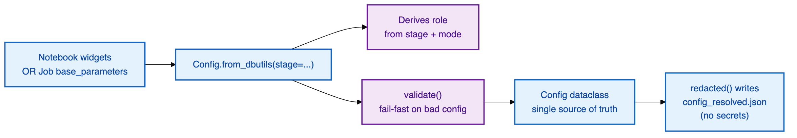

# ⚙️ Configuration Guide

The complete reference for **every widget and configuration option** in the Workspace Migration
Utility. All configuration is **widget-based** — there are no config files, and the same widget
values double as **Job parameters** (`base_parameters` in `jobs/*.job.json`).

> 💡 **No credentials live in widgets by design.** The workspace a notebook runs in uses the
> run-as SP's context token. The one secret that exists — the `direct`-mode source SP secret — is
> read from a secret scope (preferred) and always redacted from artifacts and logs.

## 📖 Contents

1. [How configuration flows](#-how-configuration-flows)
2. [Derived values (not widgets)](#-derived-values-not-widgets)
3. [Common widgets (every stage)](#-common-widgets-every-stage)
4. [`direct`-mode source connection](#-direct-mode-source-connection)
5. [`01_Inventory` widgets](#-01_inventory-widgets)
6. [`02_Export` widgets](#-02_export-widgets)
7. [`04_Import` widgets](#-04_import-widgets)
8. [`00_Install_Jobs` widgets](#-00_install_jobs-widgets)
9. [Reading the table: quick index](#-quick-index-of-every-widget)
10. [Worked examples](#-worked-examples)

---

## 🔄 How configuration flows



- **The same value works as a widget and a Job param.** `00_Install_Jobs` projects these values
  into each job's `base_parameters` once, so a scheduled Job needs no manual widget entry.
- **`validate()` fails fast** on a bad combination (e.g. `direct` mode with no
  `source_workspace_url`, or `dry_run=false` with no state catalog/schema), so a mistake surfaces at
  config time, not halfway through a migration.

---

## 🧮 Derived values (not widgets)

A few values are **computed by the tool at runtime** instead of being entered as widgets — so
there is nothing for the operator to set or mistype.

| Value | How it's derived | Why not a widget |
|-------|------------------|------------------|
| **`role`** (`source` / `target`) | From the **stage** (`inventory`/`export`/`import`) + `connectivity_mode`. `import` is always `target`; the source-reading stages are `source` in `airgap` and `target` in `direct`. | The role was never a free choice — it's a function of stage + mode. Deriving it guards against mis-runs. |
| **State table names** | Tool-owned: `wsmig_migration_state`, `wsmig_identity_map`, `wsmig_migration_state_dryrun`. | Every one of 100+ pairs lands in the same place, keyed by `source_workspace_id`. Nothing to typo. |
| **Bundle path** | `<staging_location>/wsmig/<source_workspace_id>/<run_id>/` | Layout lives in one registry (`bundle_paths.py`). |
| **`run_id`** (if blank) | Inventory auto-generates `YYYYMMDD_HHMMSS`; later stages resolve it (see below). | Lets a full pipeline share one bundle automatically. |

> 🧵 **`run_id` resolution** (import): explicit `run_id` widget → the run_id published by the
> inventory task (multi-task Job, via `taskValues`) → resume an incomplete import → `LATEST_EXPORT.json`
> pointer → **fail loudly**. A run_id is *never invented* — that would import an empty bundle and
> report a spuriously clean run.

---

## 🌐 Common widgets (every stage)

These appear on `01`, `02`, and `04` (and `00_Install_Jobs` bakes them into jobs).

| Widget | Type | Default | Description |
|--------|------|---------|-------------|
| **`connectivity_mode`** | dropdown `airgap` \| `direct` | `direct` | Which [mode](ARCHITECTURE.md#-the-two-connectivity-modes) to run. `direct` = everything in the target, source read over REST. `airgap` = two-sided, manual bundle hop. |
| **`source_workspace_id`** | text | *(required)* | Identifies the bundle path and keys every state-table row. The numeric source workspace id. |
| **`staging_location`** | text | *(required)* | **One** UC Volume path (`/Volumes/cat/sch/vol`). Managed or ADLS-backed external volume; **never raw `abfss://`**. Each run reads/writes exactly one location. In `airgap`, the source side sets location A and the target side sets location B. |
| **`run_id`** | text | *(auto)* | Blank = auto-generate (inventory) or resolve (export/import). Set explicitly to target a specific bundle. |

> ⚠️ `staging_location` is required in **every** mode/role. The deprecated
> `source_staging_location` / `target_staging_location` widgets are honored **only** as an upgrade
> fallback for an in-flight job-param JSON; new runs use the single `staging_location`.

> 🌐 **Behind a proxy?** Whether the Volume is **managed** or **external (ADLS-backed)** changes the
> `no_proxy` cluster environment variable the run needs (an external volume must also allow the Azure
> storage endpoints). See [Permissions › Network & environment prerequisites](PERMISSIONS_GUIDE.md#-network--environment-prerequisites).

---

## 🔗 `direct`-mode source connection

Only required (and only read) when **`connectivity_mode=direct`**. These tell the target how to
reach the **source** over REST.

| Widget | Type | Default | Description |
|--------|------|---------|-------------|
| **`source_workspace_url`** | text | *(required in direct)* | The source workspace URL (e.g. `https://adb-....azuredatabricks.net`). |
| **`source_sp_client_id`** | text | *(required in direct)* | The source **workspace-admin SP's `applicationId`**. This is **not a secret** — it's an identifier. |
| **`source_sp_secret_scope`** | text | *(preferred)* | Secret scope (in the **target** workspace) holding the SP's OAuth secret. **Preferred** with `source_sp_secret_key`. |
| **`source_sp_secret_key`** | text | *(preferred)* | The key within that scope. |
| **`spn_secret_value`** | text | *(fallback)* | The SP secret typed directly — a **fallback** for a first smoke test. ⚠️ A widget value is visible on the Job/run page and kept in run history. **Always redacted** from artifacts + logs. |

**Secret precedence** (explicit, so a run's credential source is never in doubt):

```
source_sp_secret_scope + source_sp_secret_key   (both set → wins)
  ↓ otherwise
spn_secret_value
  ↓ otherwise
fail fast, naming both options
```

> 🔒 **No Azure Key Vault / AAD widgets exist.** Creating an AKV-backed secret scope needs an Azure
> AD token that a Databricks SPN credential cannot mint from a private, notebook-only workspace
> (proven live). AKV-backed scopes are always reported as a clean **manual** step; Databricks-backed
> scopes migrate normally.

---

## 🔍 `01_Inventory` widgets

Read-only enumeration + identity classification. In addition to the [common](#-common-widgets-every-stage)
and [`direct`-mode](#-direct-mode-source-connection) widgets:

| Widget | Type | Default | Description |
|--------|------|---------|-------------|
| **`max_scim`** | text (int) | `0` | Cap on SCIM records per type. `0` = all. A safety cap for very large rosters / smoke tests. |
| **`max_workspace_items`** | text (int) | `0` | Cap on workspace items enumerated. `0` = all. |
| **`max_ws_api_calls`** | text (int) | `0` | Cap on workspace `list` API calls. `0` = unlimited. |
| **`force_full`** | dropdown | `false` | `true` re-scans everything, ignoring any prior inventory checkpoint. |

---

## 📤 `02_Export` widgets

Dumps enabled assets into the bundle. In addition to the common + `direct`-mode widgets (and the
same `max_scim` / `max_workspace_items` / `max_ws_api_calls` caps as inventory):

| Widget | Type | Default | Description |
|--------|------|---------|-------------|
| **`content_fetch_workers`** | text (int) | `8` | Parallel workers fetching notebook/file content. Raise for throughput on a large workspace, lower to be gentle on APIs. |
| **`force_full_export`** | dropdown | `false` | `true` re-exports everything, ignoring the export checkpoint. |

### 🎚️ Per-asset toggles (`migrate_*`) — bundle scope

These decide **what goes into the bundle**. All default **`true`**; flip to `false` to skip a whole
family at export. Set them **on the source side** (`02_Export`) — they are *bundle scope*, not an
import selector.

| Widget | Family | Default |
|--------|--------|:-------:|
| `migrate_identity` | Users, SPs, groups, entitlements | `true` |
| `migrate_compute` | Pools, policies, clusters | `true` |
| `migrate_workspace` | Dirs, notebooks, files, repos | `true` |
| `migrate_secrets` | Secret scopes + ACLs | `true` |
| `migrate_jobs` | Jobs | `true` |
| `migrate_sql` | Warehouses, queries, alerts | `true` |
| `migrate_dlt` | DLT pipelines | `true` |
| `migrate_dashboards` | AI/BI (Lakeview) dashboards | `true` |
| `migrate_genie` | Genie spaces | `true` |
| `migrate_serving` | Model serving endpoints | `true` |
| `migrate_misc` | Global init scripts, cluster libs, workspace conf | `true` |

> 🧭 **Toggles vs selector:** `migrate_*` (here) is *bundle scope* — what gets exported, set
> identically on both airgap sides. `import_assets` (on `04_Import`) is *this session's work list*
> over what the bundle already contains. See [Import selection](#-import-selection--retries).

---

## 📥 `04_Import` widgets

Creates assets on the target. In addition to the common + `direct`-mode widgets:

### Core

| Widget | Type | Default | Description |
|--------|------|---------|-------------|
| **`dry_run`** | dropdown | `true` | **Run this first.** `true` = a full rehearsal: real reads, real create/update/skip decisions, **zero writes** to the target. Flip to `false` only once the rehearsal reads clean. |
| **`state_catalog`** | text | `""` | The shared catalog for the migration state table. **Required when `dry_run=false`.** Assumed to already exist. |
| **`state_schema`** | text | `""` | The shared schema for the state table. **Required when `dry_run=false`.** Assumed to already exist. |
| **`account_id`** | text | `""` | Optional. Enables account-level preflight checks (identity assignment). |

> 🧯 **Why the state schema is mandatory when live:** without durable state a crash leaves no
> `source → target` id map, so the next run can't tell CREATE from UPDATE and may duplicate objects.
> A dry run needs no UC setup at all (it writes to a separate `…_dryrun` table only if a catalog is
> given).

### 🗂️ Import selection & retries

| Widget | Type | Default | Description |
|--------|------|---------|-------------|
| **`import_assets`** | multiselect | `all` | Which asset families to import **this session**. `all` = every family in the bundle. Options: `identity`, `compute`, `workspace`, `secrets`, `jobs`, `sql`, `dlt`, `dashboards`, `genie`, `serving`, `misc`, `acls`. `acls` is independently selectable because permission replay often needs a second pass. |
| **`retry_mode`** | dropdown | `off` | Narrows the work list to outstanding units after you fix a prerequisite. One dropdown (not booleans) so an invalid combo can't be set: `off` · `failed_only` · `skipped_only` · `failed_and_skipped`. |
| **`force_full_import`** | dropdown | `false` | `true` ignores the checkpoint and re-evaluates every unit. |

### 🛡️ Safety & behavior

| Widget | Type | Default | Description |
|--------|------|---------|-------------|
| **`preflight_enforce`** | dropdown | `true` | `true` = a preflight **NO-GO stops the run**. `false` = run anyway (not recommended). |
| **`allow_deletes`** | dropdown | `false` | `false` = objects deleted in source are **reported only**. `true` = allow deleting the corresponding target objects. Deletes are never automatic by default. |
| **`library_force_start_clusters`** | dropdown | `false` | `false` = never start a terminated cluster to install libraries (never burns DBUs silently). `true` = start → install → stop clusters IT started (never one already running). |
| **`workspace_home_backup`** | dropdown | `true` | An **orphaned home** is content under `/Users/<owner>` whose owner was deleted in source. `true` = divert it to a top-level backup folder (no bytes lost). `false` = fail it as a prerequisite. |
| **`workspace_home_backup_root`** | text | `/Users_Backup` | Top-level folder for orphaned-home backups. Normalized to a leading `/`, no trailing `/`. |

### 🔧 Transform options

Applied inside `04_Import` (mappings / excludes / schedules).

| Widget | Type | Default | Description |
|--------|------|---------|-------------|
| **`pause_job_schedules`** | dropdown | `true` | `true` = imported job schedules **and** continuous triggers are paused, so a migrated job doesn't start firing on the target unexpectedly. |
| **`user_domain_mapping`** | text | `""` | Remap identity domains: `old.com=new.com,other.com=new.com`. |
| **`user_id_mapping`** | text | `""` | Remap specific identities: `old@a.com=new@b.com,...`. |
| **`dab_bundle_roots`** | text (CSV) | `.bundle` | Path indicators for DAB-deployed asset detection. Default `.bundle` = the CLI standard (byte-identical to prior behavior). Set additional folder-name globs or absolute dir prefixes if a team roots bundles elsewhere. *(Advanced; jobs/DLT are unaffected — they use the reliable `deployment.kind` field.)* |

> ❗ The per-asset `migrate_*` toggles are **not** on import — they are bundle scope (source side).
> On import, `import_assets` is the selector instead.

---

## 🏗️ `00_Install_Jobs` widgets

Runs in the **target** workspace. Idempotently deploys the selected `jobs/*.job.json` and projects
the one-time config into each job's `base_parameters` (so scheduled runs need no manual widget entry).

| Widget | Type | Default | Description |
|--------|------|---------|-------------|
| **`deploy_jobs`** | multiselect | `direct_end_to_end_dry_run` | Which packaged jobs to create/reset. See the [job catalog](#-packaged-jobs) below. |
| **`run_as_sp`** | text | *(required)* | The **target workspace-admin SP's `applicationId`** the jobs run as (`RUN_AS_SP` token). |
| **`allow_secret_in_job_params`** | dropdown | `false` | `false` = never bake `spn_secret_value` into job params (use a secret scope pointer instead). `true` = opt-in to baking it (visible in run history — avoid). |

Plus the common widgets (`connectivity_mode`, `source_workspace_id`, `staging_location`), the
`direct`-mode source connection widgets, and `state_catalog` / `state_schema` / `account_id` —
all of which it writes into the jobs it creates.

### 📦 Packaged jobs

Checked-in Jobs API 2.2 definitions in `jobs/`, installed by `00_Install_Jobs`. Placeholders
`REPO_PATH` (the Git-folder path) and `RUN_AS_SP` are filled at install time.

| Job | Tasks | Use it for |
|-----|-------|-----------|
| **`direct_end_to_end_dry_run`** | `inventory → export → import` (import pinned `dry_run=true`) | The **first** `direct` run — rehearse the whole pipeline |
| **`direct_end_to_end_live`** | `inventory → export → import` (import pinned `dry_run=false`) | The **live** `direct` run, after the dry run reads clean |
| **`inventory`** | `01_Inventory` | Single-stage inventory |
| **`export`** | `02_Export` | Single-stage export |
| **`import`** | `04_Import` | Single-stage import |
| **`airgap_source`** | `01_Inventory → 02_Export` | The **source side** of an `airgap` migration |

---

## 🗃️ Quick index of every widget

<details>
<summary><b>Click to expand — alphabetical index</b></summary>

| Widget | Stage(s) | Default |
|--------|----------|---------|
| `account_id` | import, install | `""` |
| `allow_deletes` | import | `false` |
| `allow_secret_in_job_params` | install | `false` |
| `connectivity_mode` | all | `direct` |
| `content_fetch_workers` | export | `8` |
| `dab_bundle_roots` | import (source-derived) | `.bundle` |
| `deploy_jobs` | install | `direct_end_to_end_dry_run` |
| `dry_run` | import | `true` |
| `force_full` | inventory | `false` |
| `force_full_export` | export | `false` |
| `force_full_import` | import | `false` |
| `import_assets` | import | `all` |
| `library_force_start_clusters` | import | `false` |
| `max_scim` | inventory, export | `0` |
| `max_workspace_items` | inventory, export | `0` |
| `max_ws_api_calls` | inventory, export | `0` |
| `migrate_*` (11 toggles) | export | `true` |
| `pause_job_schedules` | import | `true` |
| `preflight_enforce` | import | `true` |
| `retry_mode` | import | `off` |
| `run_as_sp` | install | *(required)* |
| `run_id` | all | *(auto)* |
| `source_sp_client_id` | direct: all | *(required in direct)* |
| `source_sp_secret_key` | direct: all | *(preferred)* |
| `source_sp_secret_scope` | direct: all | *(preferred)* |
| `source_workspace_id` | all | *(required)* |
| `source_workspace_url` | direct: all | *(required in direct)* |
| `spn_secret_value` | direct: all | *(fallback)* |
| `staging_location` | all | *(required)* |
| `state_catalog` | import, install | `""` (required live) |
| `state_schema` | import, install | `""` (required live) |
| `user_domain_mapping` | import | `""` |
| `user_id_mapping` | import | `""` |
| `workspace_home_backup` | import | `true` |
| `workspace_home_backup_root` | import | `/Users_Backup` |

</details>

---

## 🧪 Worked examples

### Example 1 — `direct` mode, first dry run (recommended start)

```
connectivity_mode        = direct
source_workspace_id      = 1234567890123456
staging_location         = /Volumes/mig_catalog/staging/wsmig_vol
source_workspace_url     = https://adb-<source>.azuredatabricks.net
source_sp_client_id      = <source-admin-SP-appId>
source_sp_secret_scope   = wsmig
source_sp_secret_key     = source_sp_secret
dry_run                  = true            # rehearse first
import_assets            = all
# state_catalog / state_schema NOT required for a dry run
```

### Example 2 — `direct` mode, live run

```
# …everything from Example 1, plus:
dry_run                  = false
state_catalog            = mig_catalog     # must already exist
state_schema             = wsmig_state     # must already exist
pause_job_schedules      = true
```

### Example 3 — retry only what failed, after fixing a prerequisite

```
# …same identity + staging config, then:
dry_run                  = false
retry_mode               = failed_only
import_assets            = all
```

### Example 4 — re-run just permissions after a DAB redeploy

```
dry_run                  = false
import_assets            = acls
retry_mode               = skipped_only
```

### Example 5 — `airgap` source side

```
# Run inside the SOURCE workspace (01_Inventory + 02_Export, or the airgap_source job):
connectivity_mode        = airgap
source_workspace_id      = 1234567890123456
staging_location         = /Volumes/src_catalog/staging/wsmig_vol   # location A
# no source_* widgets — airgap runs INSIDE the source
```

Then ops moves the bundle to **location B**, and `04_Import` runs inside the target with
`staging_location = <location B>`.

---

## 📚 Next

- 📋 Put it together, step by step → **[Runbook](RUNBOOK.md)**
- 🔐 What access these SPs need → **[Permissions Guide](PERMISSIONS_GUIDE.md)**
- 🏗️ Why it's shaped this way → **[Architecture](ARCHITECTURE.md)**
