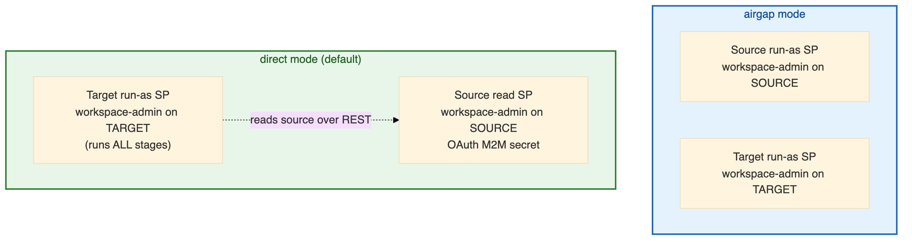
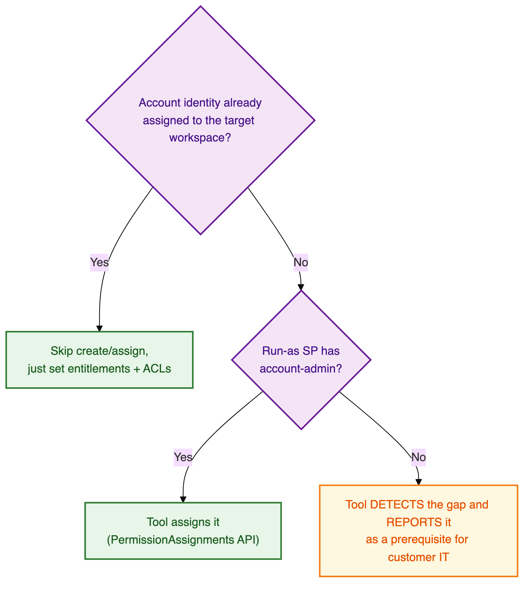

# 🔐 Permissions Guide

Exactly what access the Workspace Migration Utility needs, **per mode**, and the **minimum a
customer must grant**. Every requirement and gotcha here was **verified live** on the customer
environment — this is the guide to hand to whoever provisions access.

> ## ✅ TL;DR — the minimum
>
> | Identity | Where | Minimum access |
> |----------|-------|----------------|
> | **Target run-as SP** | Target workspace | **Workspace admin** |
> | **Source read SP** *(only in `direct` mode)* | Source workspace | **Workspace admin** *(member of the source `admins` group)* + a Databricks **OAuth (M2M) secret** |
> | Either SP | Target Unity Catalog | On the **state** catalog/schema: `USE CATALOG`, `USE SCHEMA`, `CREATE TABLE` + `MODIFY`/`SELECT` |
> | Either SP | Target staging Volume | `READ VOLUME` + `WRITE VOLUME` |
>
> **Workspace-admin is the baseline the entire tool assumes.** Account-admin is **optional**
> (it only automates account-identity *assignment*; the tool degrades gracefully and reports the
> gap without it). **No PATs, ever.**

## 📖 Contents

1. [The identities involved](#-the-identities-involved)
2. [Baseline: workspace-admin (both modes)](#-baseline-workspace-admin-both-modes)
3. [`direct` mode: the source read SP](#-direct-mode-the-source-read-sp)
4. [Unity Catalog & data-plane grants](#-unity-catalog--data-plane-grants)
5. [Network & environment prerequisites](#-network--environment-prerequisites)
6. [Optional: account-admin](#-optional-account-admin)
7. [What the tool will NEVER do for you (manual grants)](#-what-the-tool-will-never-do-for-you)
8. [Per-mode permission matrix](#-per-mode-permission-matrix)
9. [Troubleshooting: symptom → permission cause → fix](#-troubleshooting-symptom--cause--fix)
10. [Setup checklist](#-setup-checklist)

---

## 👤 The identities involved



| Mode | Identities you must provision |
|------|-------------------------------|
| **`airgap`** | A **workspace-admin SP on the source** (runs `01`/`02`) **and** a **workspace-admin SP on the target** (runs `04`). They never talk to each other. |
| **`direct`** | A **workspace-admin SP on the target** (runs everything) **and** a **workspace-admin SP on the source** with an **OAuth M2M secret** (read over REST). |

> Auth is always the run-as SP's **notebook-context token** for the workspace a notebook runs in
> (SDK ambient auth). Only `direct` mode's source read uses OAuth M2M. See
> [Architecture › Auth model](ARCHITECTURE.md#-auth-model).

---

## 🛡️ Baseline: workspace-admin (both modes)

**Workspace-admin is the read/write baseline the entire tool is built on.** A non-admin identity
does not merely lose a feature — it **silently degrades** the migration (see the incident below).

**Why workspace-admin is required:**

| Capability | Needs workspace-admin because… |
|------------|-------------------------------|
| Read the full identity roster | Workspace SCIM returns **complete** group objects (with `meta.resourceType` + members) only to an admin. A non-admin gets **skeletal** groups. |
| Enumerate & create all asset types | Listing/creating clusters, jobs, warehouses, secret scopes, permissions, etc. requires admin. |
| Read + write object permissions (ACLs) | The ACL replay pass reads and PUTs permissions across every object type. |
| Assign identities to the workspace | `permissionassignments` (workspace-side) needs admin. |

**Preflight enforces it (BLOCKING):** `04_Import` verifies the target SP can read workspace SCIM
before any write; if it can't, the run stops with a clear message rather than half-migrating.

> ### 🚨 Live incident — "all my groups show as *manual*"
> A `direct`-mode run suddenly reported **every group** as "a manual step required." It was **not**
> a code bug. The **source read SP was not a member of the source `admins` group**, so workspace
> SCIM returned **skeletal** group objects (just `id` + `displayName`, no `meta.resourceType`, no
> members). Because `meta.resourceType` is the *only* signal that distinguishes a workspace-local
> group from an account group, every group was escalated to `needs_review` → `manual`.
>
> **Fix:** add the source read SP to the source workspace **`admins`** group and re-run. **Rule of
> thumb:** mass `needs_review`/`manual` identities or empty group membership ⇒ suspect the source
> SP's privilege, not the tool.

---

## 🔗 `direct` mode: the source read SP

`direct` mode reads the source over REST using a **source SP + OAuth M2M secret**. Two requirements:

### 1. It must be a **workspace-admin** on the source
A non-admin source SP degrades identity classification silently (see the incident above). **Add it
to the source `admins` group.**

The SP needs a **Databricks OAuth (M2M) secret** (`client_id` + secret). Any account service
principal that can hold an OAuth secret works — whether it was created directly in the Databricks
account **or** is an Entra / Azure managed-identity SP imported into the account. What matters is
that it is a source workspace-admin and has a Databricks OAuth secret.

### 2. The secret is supplied safely
Prefer a **target-workspace secret scope** (`source_sp_secret_scope` + `source_sp_secret_key`) — the
run-as SP needs **`READ`** on that scope. The widget fallback (`spn_secret_value`) works for a first
smoke test but is visible on the run page and kept in run history. Either way the secret is
**always redacted** from artifacts + logs.

> Preflight BLOCKING check (`direct` only): the source client must authenticate **and** prove
> admin scope, or the run stops.

---

## 🗄️ Unity Catalog & data-plane grants

These are **UC / data-plane** grants (separate from workspace-admin) on the **target**.

### State catalog + schema (required when `dry_run=false`)

The migration state tables live in **one shared catalog + schema** across all pairs. **The
catalog and schema must already exist** — the tool creates the *tables* but **never** the
catalog/schema (and `CREATE CATALOG` fails on these workspaces anyway: "Default Storage is
enabled").

Grant the run-as SP, on that schema:

| Grant | Why |
|-------|-----|
| `USE CATALOG` on the state catalog | Reach the schema |
| `USE SCHEMA` on the state schema | Reach the tables |
| `CREATE TABLE` on the state schema | `ensure_table()` creates `wsmig_migration_state` etc. if absent |
| `MODIFY` + `SELECT` on the state schema | UPSERT and read back the `source → target` id map each run |

> Without durable state, a live run is a correctness hazard (a crash leaves no id map, so the next
> run can't tell CREATE from UPDATE and may duplicate). That's why the state schema is a **BLOCKING**
> preflight check when live.

### Staging Volume

The run-as SP needs `READ VOLUME` + `WRITE VOLUME` on the UC Volume behind `staging_location`
(bundle read/write). For an **external** (ADLS-backed) volume, the usual external-location
prerequisites apply.

### Data access for *testing* migrated DLT / Genie / dashboards *(not for import itself)*

Import does **not** read table data. But if you want to *test* a migrated Genie space or DLT
pipeline that references UC tables by FQN, the run-as SP needs `USE CATALOG` / `USE SCHEMA` +
`SELECT` on those referenced tables (UC is out of scope, so those tables must pre-exist on target).

---

## 🌐 Network & environment prerequisites

In a private / VDI-only workspace with locked-down egress, arrange these **before** the first run.
They are one-time cluster configuration, not identity grants — but they block the run just as hard.

| Requirement | What to arrange |
|-------------|-----------------|
| **Compute** | Run on an **all-purpose (classic) cluster** in the workspace's network when the workspace isn't on the public internet and the Databricks serverless IP ranges aren't whitelisted. Serverless may not reach the control plane or the staging Volume. |
| **Proxy bypass (`no_proxy`)** | If the cluster egresses through an HTTP proxy, set a `no_proxy` / `NO_PROXY` **cluster environment variable** (not Spark config) so Databricks **and** the staging storage bypass the proxy — otherwise Volume writes stall and the bundle lands empty. |
| **Library availability** | The notebooks use `databricks-sdk`, `openpyxl`, `requests`. If `%pip install` / public PyPI is blocked, pre-install them as **cluster libraries** (or via your Databricks pip-proxy index). |

**`no_proxy` entries by staging Volume type** *(check with `DESCRIBE VOLUME`)*:

| Staging Volume | `no_proxy` must include |
|----------------|-------------------------|
| **Managed** | `*.azuredatabricks.net,*.databricks.azure.com,169.254.169.254,127.0.0.1` *(Databricks only)* |
| **External (ADLS-backed)** | the managed list **plus** `.dfs.core.windows.net,.blob.core.windows.net` *(Azure storage)* |

### 📦 Python dependency whitelist (when the proxy allows PyPI *per library*)

If the proxy allows PyPI **per project** (each library and its own dependencies whitelisted
individually — not `pypi.org` wholesale), you must whitelist the tool's libraries **and their full
transitive closure**. The tool declares three direct dependencies (`requirements.txt`); their
typical closure is below.

> ⚠️ **The exact closure depends on the Databricks Runtime's Python version and the resolved package
> versions — treat this table as a baseline and *regenerate the authoritative list* for your
> runtime** (command below). Most of these already ship with DBR (`requests`, `databricks-sdk` and
> their chains are usually present); `openpyxl` + `et-xmlfile` are the ones most often missing.

| Package | Pulled in by | PyPI project |
|---------|--------------|--------------|
| `databricks-sdk` | direct (`requirements.txt`) | https://pypi.org/project/databricks-sdk/ |
| `openpyxl` | direct (`requirements.txt`) | https://pypi.org/project/openpyxl/ |
| `requests` | direct (`requirements.txt`) | https://pypi.org/project/requests/ |
| `certifi` | `requests` | https://pypi.org/project/certifi/ |
| `charset-normalizer` | `requests` | https://pypi.org/project/charset-normalizer/ |
| `idna` | `requests` | https://pypi.org/project/idna/ |
| `urllib3` | `requests` | https://pypi.org/project/urllib3/ |
| `et-xmlfile` | `openpyxl` | https://pypi.org/project/et-xmlfile/ |
| `google-auth` | `databricks-sdk` | https://pypi.org/project/google-auth/ |
| `cachetools` | `google-auth` | https://pypi.org/project/cachetools/ |
| `pyasn1` | `google-auth` chain | https://pypi.org/project/pyasn1/ |
| `pyasn1-modules` | `google-auth` | https://pypi.org/project/pyasn1-modules/ |
| `rsa` | `google-auth` | https://pypi.org/project/rsa/ |

**Regenerate the exact list for your runtime** — run this once on any host that can reach PyPI (or
through your Databricks pip-proxy index); the output is precisely what to whitelist, one project per
line:

```bash
pip install --dry-run --report wsmig_deps.json "databricks-sdk>=0.20" "openpyxl>=3.1" "requests>=2.31"
python -c "import json;[print(i['metadata']['name'], i['metadata']['version'], 'https://pypi.org/project/'+i['metadata']['name']+'/') for i in json.load(open('wsmig_deps.json'))['install']]"
```

> 💡 **Pin the resolved versions** (in `requirements.txt` or a lock file) once whitelisted — a
> floating `>=` can later resolve a *new* transitive dependency that isn't on the allow-list and
> breaks the install. Alternatively, side-step the proxy entirely: **pre-install the packages as
> cluster libraries** (from PyPI or uploaded wheels) so `%pip` is a no-op.

> The step-by-step for all of the above lives in [Runbook › Restricted-network environments](RUNBOOK.md#-restricted-network-environments-read-this-if-egress-is-locked-down).

---

## 🎫 Optional: account-admin

Account-admin is **optional**. It only unlocks **automatic assignment of account identities**
(Entra/SCIM users, Azure UMI/Entra SPs, account groups) to the target workspace.

**The tool degrades gracefully without it**, because two things make workspace-admin sufficient in
the common case:

1. **`permissionassignments` works from *inside* the workspace** — a workspace-admin can list and
   assign users, SPs, and account groups to the workspace with **no account credentials**.
2. **When source and target share an account**, an account group's workspace SCIM id **is** its
   account id, so the exported `source_id` is directly usable to assign it on the target — again,
   **no account credentials**.



> **Bottom line:** grant workspace-admin and the tool runs. If some account identities aren't yet
> assigned to the target workspace *and* nobody has account-admin, those specific identities are
> reported as a clean **prerequisite for customer IT / SCIM** — never a silent failure.

---

## 🚫 What the tool will NEVER do for you

These need privileges or steps outside a workspace-admin's reach. The tool **reports them as
clean manual actions** (in `reports/manual_actions_import.md`) rather than failing or guessing.

| Manual action | Why it can't be automated here | What to do |
|---------------|-------------------------------|------------|
| **Create Azure Key Vault-backed secret scopes** | Needs an **Azure AD** token that **no available credential can mint** from a private, notebook-only workspace: a Databricks SPN mints a *Databricks* token (wrong issuer); a managed identity refuses secret auth and can only use Azure IMDS (unreachable here). **Proven live — a hard Azure constraint, not a tool gap.** | Create the scope by hand (UI/CLI → Create Scope → Azure Key Vault) naming the vault, then re-run `retry_mode=failed_only` to adopt it. *(Databricks-backed scopes migrate automatically.)* |
| **Re-populate secret *values*** | The secrets API never exports scope values | Scope names + ACLs migrate; set the values on the target |
| **Provision/assign account identities without account-admin** | Assignment across accounts needs account-admin | Customer IT/SCIM assigns them (reported as a prerequisite) |
| **Migrate IP access lists** | Account-level in this customer (account console); a workspace-scoped tool can't see them | Account-admin configures them on target |

---

## 🧩 Per-mode permission matrix

| Requirement | `airgap` | `direct` |
|-------------|:--------:|:--------:|
| Workspace-admin SP on **source** | ✅ (runs `01`/`02`) | ✅ (**member of source `admins`**; read over REST) |
| Source SP OAuth M2M secret | ❌ (runs inside source) | ✅ (`client_id` + OAuth secret) |
| `READ` on target secret scope holding the source secret | — | ✅ (if using the scope path, preferred) |
| Workspace-admin SP on **target** | ✅ (runs `04`) | ✅ (runs everything) |
| State catalog/schema pre-exists + `USE`/`CREATE TABLE`/`MODIFY`/`SELECT` | ✅ (live import) | ✅ (live import) |
| `READ`/`WRITE VOLUME` on staging Volume | ✅ | ✅ |
| Account-admin | ⚪ optional | ⚪ optional |
| PATs | ❌ never | ❌ never |

---

## 🔧 Troubleshooting: symptom → cause → fix

| Symptom | Likely permission cause | Fix |
|---------|------------------------|-----|
| **All / most groups reported `manual` or `needs_review`** | Source read SP is **not** a source workspace-admin → skeletal SCIM groups | Add the source read SP to the source **`admins`** group; re-run |
| **Empty / under-populated group membership** | Same skeletal-read cause, or a non-admin token | Ensure source SP is workspace-admin |
| **`direct` run fails at preflight: source connectivity** | Bad `source_sp_client_id`/secret, or SP lacks admin scope | Verify the OAuth secret and that the SP is a source admin |
| **OAuth `invalid_client`** | The source SP secret rotated/expired, or the `client_id`/secret is wrong | Mint a fresh OAuth secret for the source SP and update the scope/widget |
| **Preflight BLOCKING: target workspace-admin (SCIM readable)** | Target run-as SP isn't workspace-admin | Make it a target workspace-admin |
| **Preflight BLOCKING: migration state table** | State catalog/schema missing, or SP lacks `CREATE TABLE`/`USE` | Pre-create catalog+schema; grant `USE CATALOG`/`USE SCHEMA`/`CREATE TABLE`/`MODIFY`/`SELECT` |
| **AKV secret scope reported `manual`** | Expected — AKV creation is unautomatable here | Create by hand, then `retry_mode=failed_only` |
| **Job import 403: "not authorized to use … SQL Endpoint"** | Ordering effect — the job was created before the warehouse's `CAN_USE` grant was replayed (ACLs run last) | **Just re-run `retry_mode=failed_only`** — the warehouse ACL is now in place, so the job's `run_as` can use it. *(No manual grant needed when that `CAN_USE` existed on the source.)* |
| **Account identities reported as prerequisites** | Not yet assigned to target + no account-admin | Customer IT assigns them (or grant account-admin) |

---

## 🧰 Setup checklist

The steps below are **what** to arrange, not how — do them through whichever admin surface your
environment allows (account console, workspace admin settings, the SQL editor / Catalog Explorer for
grants, etc.).

**Direct-mode source read SP:**

1. Have (or create) an **account service principal** for reading the source.
2. Create a **Databricks OAuth (M2M) secret** for it → this gives the `client_id` + secret.
3. **Assign it to the source workspace as an admin** (add it to the source `admins` group).
4. Store the secret in a **target-workspace secret scope**, and give the run-as SP `READ` on that
   scope. Then set `source_sp_secret_scope` + `source_sp_secret_key`. *(Or, for a quick smoke test
   only, pass it once via the `spn_secret_value` widget.)*

**Target run-as SP:**

1. Make it a **target workspace admin** (add to the target `admins` group).
2. On the **state catalog + schema** (which must already exist), grant it: `USE CATALOG`,
   `USE SCHEMA`, `CREATE TABLE`, `MODIFY`, `SELECT`.
3. On the **staging Volume**, grant it: `READ VOLUME`, `WRITE VOLUME`.

---

## 📚 Next

- 📋 Put access to work → **[Runbook](RUNBOOK.md)**
- ⚙️ Which widget carries which credential → **[Configuration Guide](CONFIGURATION_GUIDE.md#-direct-mode-source-connection)**
- 🏗️ Why identity is the hard part → **[Architecture › Identity model](ARCHITECTURE.md#-identity-model-the-core-of-this-utility)**
