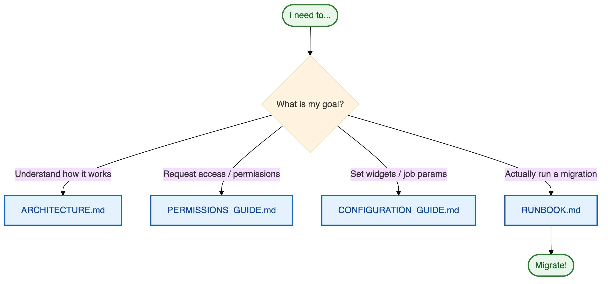
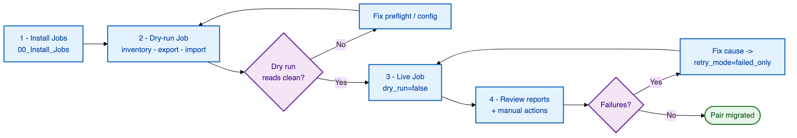

# 📚 Workspace Migration Utility — Documentation

Config-driven, notebook-based migration of **non‑UC** Databricks workspace assets from a
**source** workspace to a **target** workspace (Azure region → Azure region).

---

## 🧭 Documentation index

| # | Document | Description | Audience |
|---|----------|-------------|----------|
| 1 | **[README.md](README.md)** | This index / hub (you are here) | Everyone |
| 2 | **[ARCHITECTURE.md](ARCHITECTURE.md)** | Working model, `airgap` vs `direct`, the bundle, dependency order, scope | Everyone — read first |
| 3 | **[CONFIGURATION_GUIDE.md](CONFIGURATION_GUIDE.md)** | Every widget & config option, grouped by stage, with defaults + examples | Operators, DevOps |
| 4 | **[RUNBOOK.md](RUNBOOK.md)** | Step-by-step operator instructions for both modes, with checklists | Operators |
| 5 | **[PERMISSIONS_GUIDE.md](PERMISSIONS_GUIDE.md)** | Exact permission requirements per mode; the minimum to request | Operators, customer IT / admins |

---

## 🚦 Pick your path

---

## Overview

The utility runs as **four thin notebooks** backed by an importable `src/` package:

| Notebook | Stage | Purpose |
|----------|-------|---------|
| `01_Inventory` | inventory | **Read-only** enumeration + identity classification → report |
| `02_Export` | export | Dump enabled assets → a staging **bundle** (JSON + notebook source) + manifest/checksums |
| `04_Import` | import | **Preflight** → create/update on the target in dependency order (idempotent, checkpointed, dry-run) |
| `00_Install_Jobs` | — | Idempotent installer that deploys the pre-packaged `jobs/*.job.json` |

Two modes decide **who reads the source** and **whether the file hop is manual**:

- **`direct`** (default): everything runs in the target; the source is read over REST (OAuth M2M);
  the bundle is written straight to staging → the whole migration can be **one Job**.
- **`airgap`**: inventory/export run *inside* the source and write a bundle; ops **physically moves**
  the bundle to the target; import runs *inside* the target. **No source↔target connectivity, ever.**

Both modes emit the **same bundle**, so preflight + transforms + import are mode-agnostic.

---

## 🧱 Key concepts at a glance

| Concept | What it means |
|---------|---------------|
| **Bundle** | A run-isolated, self-describing directory (`export/` + `reports/` + `misc/`) with a `manifest.json` (asset list, counts, checksums) so the target can verify a complete upload before acting. |
| **Staging location** | One UC Volume path (`/Volumes/…`). Each run reads/writes exactly one location. |
| **Idempotent + incremental** | Every asset is UPSERTed against a Delta **state table**, so re-runs create the new, update the changed, skip the unchanged, and report deletions. |
| **Dry run** | The default for import. A full rehearsal: real reads and real decisions, **zero writes** to the target. |
| **Preflight gate** | A verify-only go/no-go check before any write (bundle integrity, staging readable, target admin, state schema, source connectivity). |
| **Fail-soft units** | One asset's failure is recorded with its reason; the run continues. Only a handful of *pre-flight* conditions stop the whole run. |
| **Identity classification** | Users / account SPs stay stable; Databricks-managed SPs & groups are recreated and an `old → new` map is persisted. |

Full detail in **[ARCHITECTURE.md](ARCHITECTURE.md)**.

---

## 🗺️ The happy path (direct mode)

Every step, with exact widget values, is in the **[Runbook](RUNBOOK.md)**.

---

## 🏷️ Versioning & changelog

The utility follows [Semantic Versioning](https://semver.org/) (`MAJOR.MINOR.PATCH`). The number
lives in one place — the root [`VERSION`](../VERSION) file — and the tool stamps it into every
bundle's `manifest.json`, `export_index.json`, and the migration state table, so each artifact
records exactly which build produced it.

- **PATCH** (`1.0.0 → 1.0.1`) — backward-compatible bug fixes (a fixed importer, a corrected report).
- **MINOR** (`1.0.0 → 1.1.0`) — backward-compatible additions (a new asset type, a new widget/option).
- **MAJOR** (`1.0.0 → 2.0.0`) — breaking changes (bundle-format or state-schema change, removed/renamed
  widgets, a changed default that needs operator action).

Record every change in the root **[CHANGELOG.md](../CHANGELOG.md)** (accumulate under *Unreleased*,
then rename to the new version + date at release and bump `VERSION`).
