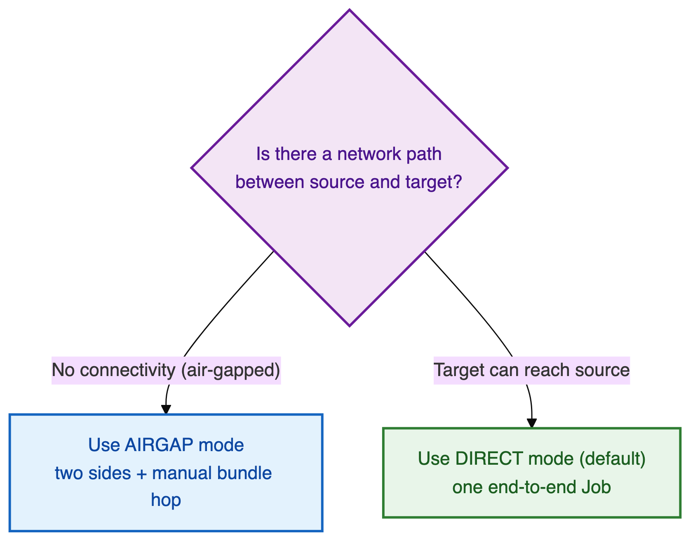
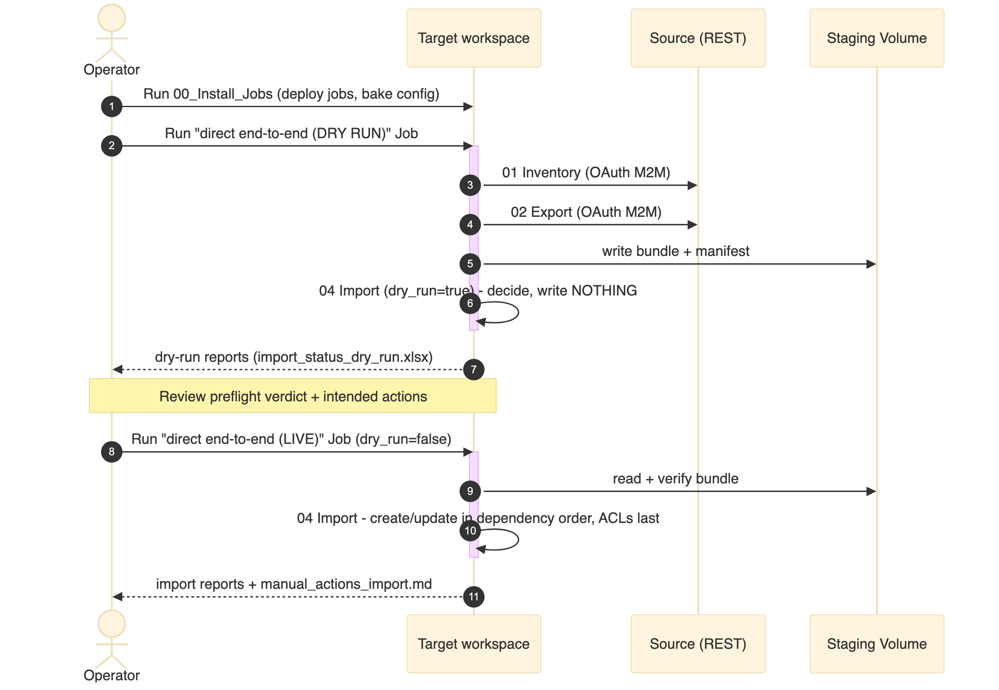
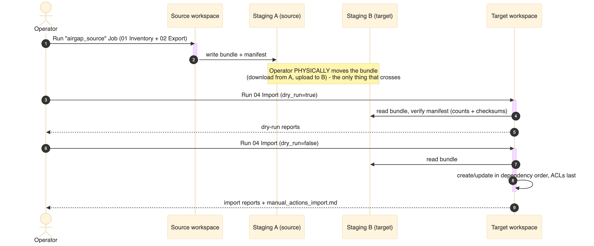
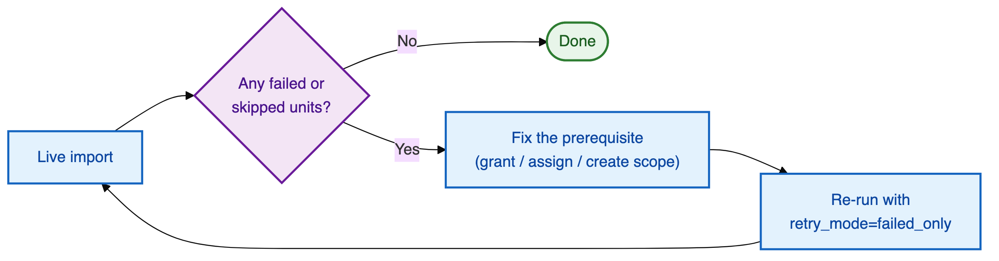

# 📋 Runbook

The step-by-step guide to running a real migration. Follow it top to bottom. Every step names the
**exact widget values** to set and **what you should see** before moving on.

> 🧭 **First time?** Read the [Architecture overview](ARCHITECTURE.md#-the-big-picture) (5 min) and
> confirm access with the [Permissions Guide](PERMISSIONS_GUIDE.md). Then start here.

## 📖 Contents

1. [Before you begin — prerequisites](#-before-you-begin--prerequisites)
2. [Choose your mode](#-choose-your-mode)
3. [Path A — `direct` mode (recommended)](#-path-a--direct-mode-recommended)
4. [Path B — `airgap` mode](#-path-b--airgap-mode)
5. [Reading the outputs](#-reading-the-outputs)
6. [Handling failures & manual actions](#-handling-failures--manual-actions)
7. [Re-running (incremental migrations)](#-re-running-incremental-migrations)
8. [Quick reference card](#-quick-reference-card)

---

## ✅ Before you begin — prerequisites

Tick every box before your first run. Details are in the [Permissions Guide](PERMISSIONS_GUIDE.md).

| ☐ | Prerequisite | How to satisfy |
|---|--------------|----------------|
| ☐ | **Target run-as SP is a target workspace-admin** | Add the SP to the target `admins` group |
| ☐ | **Staging UC Volume exists** and the run-as SP has `READ`/`WRITE VOLUME` | Create a `/Volumes/<cat>/<sch>/<vol>` path |
| ☐ | **State catalog + schema exist** (for live runs) and the SP can `USE` + `CREATE TABLE` + `MODIFY`/`SELECT` | Pre-create the shared catalog+schema; the tool creates the tables |
| ☐ | **Repo pulled into the target** as a Git folder | Databricks → Repos → add this repo |
| ☐ *(direct only)* | **Source read SP is a source workspace-admin** with a Databricks **OAuth M2M secret** (`client_id` + secret) | See [Permissions › source SP](PERMISSIONS_GUIDE.md#-direct-mode-the-source-read-sp) |
| ☐ *(direct only)* | **Source secret stored in a target secret scope** (preferred), run-as SP has `READ` on it | Store the secret in a scope → set `source_sp_secret_scope` / `source_sp_secret_key` |

> ⚠️ **Do the dry run first, always.** Import defaults to `dry_run=true` — a full rehearsal that
> writes nothing. Never set `dry_run=false` until a dry run reads clean.

### 🔒 Restricted-network environments (read this if egress is locked down)

Private, VDI-only workspaces with an outbound proxy and no public PyPI need three things set up
before the first run. All are one-time cluster configuration.

**1. Use an all-purpose (classic) cluster — not serverless.**
If the workspaces are not reachable over the public internet **and** the Databricks serverless IP
ranges are **not** whitelisted, run these notebooks/jobs on an **all-purpose (classic) cluster** in
the workspace's own network. Serverless compute may not be able to reach the workspace/control plane
or the staging Volume. Point the jobs at an existing all-purpose cluster.

**2. Set `no_proxy` as cluster _Environment variables_ (not Spark config).**
If the cluster's egress goes through an HTTP proxy, traffic to the Databricks control plane **and**
to the staging Volume's storage must bypass it — otherwise Volume writes can stall or fail and the
bundle lands empty. Add `no_proxy` (and `NO_PROXY`) under the cluster's **Advanced options →
Environment variables**:

| Staging Volume type | `no_proxy` entries |
|---------------------|--------------------|
| **Managed** | `*.azuredatabricks.net,*.databricks.azure.com,169.254.169.254,127.0.0.1` *(Databricks only)* |
| **External (ADLS-backed)** | the managed list **plus** `.dfs.core.windows.net,.blob.core.windows.net` *(Azure storage)* |

> It must be an **OS environment variable**, not Spark config (Spark config does nothing here). Run
> `DESCRIBE VOLUME <catalog>.<schema>.<volume>` to check whether your staging Volume is managed or
> external.

**3. Handle the libraries when `%pip install` is blocked.**
The notebooks pull `databricks-sdk`, `openpyxl`, and `requests` via `%pip`. Two options:
- **Pre-install them as cluster libraries** on the all-purpose cluster (from PyPI or uploaded
  wheels) so the `%pip` cell is a no-op — simplest when PyPI is fully blocked.
- **Whitelist them on the proxy** — but note a per-project proxy needs each library **and its full
  transitive dependencies** allow-listed individually. The complete list, plus a one-liner to
  regenerate the exact closure for your runtime, is in
  [Permissions › Python dependency whitelist](PERMISSIONS_GUIDE.md#-python-dependency-whitelist-when-the-proxy-allows-pypi-per-library).

`databricks-sdk` and `requests` usually ship with the runtime; `openpyxl` (used for the Excel
reports) is the one most often missing.

> 📈 **Very large source workspaces:** for a workspace with hundreds of thousands of assets, give the
> cluster a **larger-memory driver** (e.g. 64–128 GB). Migrations are infrequent, so size up for the
> rare huge workspace rather than tuning.

---

## 🔀 Choose your mode



| If… | Use | Why |
|-----|-----|-----|
| The target **can reach** the source over the network | **`direct`** *(default)* | One end-to-end Job, no manual file hop |
| There is **no connectivity** between source and target | **`airgap`** | Two sides + a manual bundle handoff |

---

## 🟢 Path A — `direct` mode (recommended)

Everything runs in the **target** workspace. The whole migration is two Job runs: a **dry run**,
then a **live run**.



### Step 1 · Install the jobs

Open **`notebooks/00_Install_Jobs`** in the target workspace and set:

| Widget | Value |
|--------|-------|
| `deploy_jobs` | `direct_end_to_end_dry_run`, `direct_end_to_end_live` |
| `run_as_sp` | the target workspace-admin SP's `applicationId` |
| `connectivity_mode` | `direct` |
| `source_workspace_id` | the numeric source workspace id |
| `staging_location` | `/Volumes/<cat>/<sch>/<vol>` |
| `source_workspace_url` | `https://adb-<source>.azuredatabricks.net` |
| `source_sp_client_id` | the source read SP's `applicationId` |
| `source_sp_secret_scope` / `source_sp_secret_key` | pointer to the stored secret |
| `state_catalog` / `state_schema` | your shared, pre-existing catalog + schema |

**Run it.** ✅ *Expected:* the two jobs appear under **Jobs & Pipelines**, with config baked into
their parameters. You won't need to re-enter widgets on the jobs themselves.

> 💡 Prefer the secret **scope pointer** over `spn_secret_value`, and keep
> `allow_secret_in_job_params=false` so no secret is ever written into a job definition.

### Step 2 · Run the dry run

Run the **`wsmig - direct end-to-end (DRY RUN)`** job. It runs `01 Inventory → 02 Export →
04 Import` with the import task pinned `dry_run=true`.

✅ *Expected:* the job succeeds; the import task **writes nothing to the target**; a
`import_status_dry_run.xlsx` and a preflight verdict are produced.

### Step 3 · Read the dry-run reports

Open the bundle at `<staging_location>/wsmig/<source_workspace_id>/<run_id>/`:

1. **Preflight verdict** (printed in the import task output + `misc/preflight_report.json`) — must
   be **GO**. Fix anything 🔴 **BLOCKING** first (see [Permissions troubleshooting](PERMISSIONS_GUIDE.md#-troubleshooting-symptom--cause--fix)).
2. **`reports/import_status_dry_run.xlsx`** — one sheet per asset type, showing the **intended
   action** (create / update / skip / manual) for every unit. Scan for surprises.

> 🚦 **Gate:** proceed only when preflight is **GO** and the intended actions look right.

### Step 4 · Run the live migration

Run the **`wsmig - direct end-to-end (LIVE)`** job (identical, but import is pinned
`dry_run=false`). ✅ *Expected:* assets are created/updated on the target in dependency order,
ACLs replayed last, and `reports/import_status.xlsx` + `reports/manual_actions_import.md` are
written.

### Step 5 · Review & finish

Work through [Reading the outputs](#-reading-the-outputs) and
[Handling failures & manual actions](#-handling-failures--manual-actions).

> ℹ️ Prefer to run stages individually (e.g. re-import only)? Use the single-task `inventory` /
> `export` / `import` jobs, or open the notebooks directly — the widget values are the same.

---

## 🔵 Path B — `airgap` mode

Two sides that never connect. A human moves the bundle between them.



### On the SOURCE side

**Step 1 · Pull the repo into the source workspace** as a Git folder.

**Step 2 · Install + run the source job.** In `00_Install_Jobs` set `deploy_jobs=airgap_source`,
`connectivity_mode=airgap`, `source_workspace_id`, `staging_location = <location A>`, `run_as_sp` =
the **source** workspace-admin SP. Run the **`wsmig - airgap_source`** job (`01 Inventory →
02 Export`). *(No `source_*` widgets — airgap runs inside the source.)*

✅ *Expected:* a complete bundle under `<location A>/wsmig/<source_workspace_id>/<run_id>/` with a
`misc/manifest.json`.

### The HANDOFF

**Step 3 · Move the bundle.** Download the entire run directory from **location A** and upload it to
the target-readable **location B**, preserving the folder structure.

> ⚠️ Move the **whole** run directory (including `misc/manifest.json`). The target verifies counts +
> checksums against the manifest before it acts — an incomplete upload is caught at preflight.

### On the TARGET side

**Step 4 · Import (dry run).** Pull the repo into the **target**. Open `04_Import` (or install the
`import` job) with `connectivity_mode=airgap`, `source_workspace_id`, `staging_location = <location
B>`, `run_id = <the run id from location A>`, `dry_run=true`. Run it and read the dry-run reports
(same as [direct Step 3](#step-3--read-the-dry-run-reports)).

**Step 5 · Import (live).** Re-run with `dry_run=false` + `state_catalog`/`state_schema`. Review as
below.

---

## 📂 Reading the outputs

Everything lands in the bundle at `<staging_location>/wsmig/<source_workspace_id>/<run_id>/`:

| File | Where | What it tells you |
|------|-------|-------------------|
| **`reports/import_status.xlsx`** *(live)* / **`import_status_dry_run.xlsx`** *(dry)* | `reports/` | One sheet **per asset type** — action, status, and notes for every unit. Includes the **ACL Parity** sheet (source-vs-target permission diff). **Read this first.** |
| **`reports/manual_actions_import.md`** | `reports/` | The checklist of steps only a human can do (secret values, AKV scopes, legacy dashboards, Git repos). |
| **`misc/preflight_report.json`** | `misc/` | The graded go/no-go verdict. |
| **`misc/import_results.json`** | `misc/` | Machine-readable per-unit results. |
| **`misc/execution*.log`** | `misc/` | Full execution log. |

**Import statuses you'll see:**

| Status | Meaning |
|--------|---------|
| `created` / `updated` / `adopted` | Succeeded (new / changed / matched an existing target object) |
| `skipped` | Unchanged since last run (fingerprint match) |
| `created_with_warning` | Exists on target but is known-degraded — **verify before use** |
| `manual` | Needs a human step (see `manual_actions_import.md`) |
| `deleted_in_source` | Existed on a previous run but is **now gone from the source** — **reported only**, never auto-deleted on the target (unless `allow_deletes=true`) |
| `skipped_no_object` | A permission waiting on an object this run didn't create (normal for DAB/repos) |
| `not_selected` | Not in this session's `import_assets` list |
| `failed` | A per-unit failure — fixable, then retry (**does not** mean the run broke) |

---

## 🔧 Handling failures & manual actions

A `failed` unit is **not** a broken run — it's recorded with its reason and the run continues.
Fix the cause, then re-run only the outstanding units.



**The pattern:**

1. Open `reports/import_status.xlsx` and read the failure note (it always carries the **verbatim
   server message** + a remediation hint).
2. Fix the cause (grant a permission, assign an identity, create an AKV scope, etc.).
3. Re-run `04_Import` with **`retry_mode=failed_only`** — only the failed/degraded units re-run.
   Every re-run still makes the full upsert decision, so a retry can **never** duplicate.

**Common manual actions** (from `manual_actions_import.md`):

| Manual action | What to do | Then |
|---------------|-----------|------|
| **Secret *values*** | Scope names + ACLs migrated; set the actual values on the target | — |
| **Azure Key Vault-backed scope** | Create by hand (UI → Create Scope → Azure Key Vault), naming the vault | `retry_mode=failed_only` |
| **Legacy SQL dashboards** | Rebuild the visual layout (underlying queries already migrated) | — |
| **Git repos** | Recreate from the exported metadata (url / provider / branch / path) | — |
| **Account identities not assigned** | Customer IT/SCIM assigns them (or grant account-admin) | re-run identity |
| **Permissions waiting on a DAB redeploy** | Redeploy the bundle to the target, then | `import_assets=acls` + `retry_mode=skipped_only` |

> 🔁 After you fix identities or redeploy a DAB, re-running just **`import_assets=acls`** with
> `retry_mode=skipped_only` back-fills the permissions that were waiting.

> ⚙️ **A job that 403s on a SQL warehouse** ("not authorized to use or monitor this SQL Endpoint")
> is usually just an **ordering effect**, not a missing permission: jobs are created before the
> warehouse's `CAN_USE` grant is replayed (**ACLs run last**). A plain **`retry_mode=failed_only`**
> re-run fixes it — the grant is now in place. No manual grant is needed when that `CAN_USE` existed
> on the source (it's migrated with the warehouse's ACLs).

---

## ♻️ Re-running (incremental migrations)

Re-runs are **expected and safe** — the same pair is migrated repeatedly over its life. Every asset
is UPSERTed against the state table:

- **New** source assets → created
- **Changed** source assets → updated (the stored target object, not a duplicate)
- **Unchanged** → skipped
- **Deleted in source** → reported (never auto-deleted unless `allow_deletes=true`)

Just run the live job again. Each run emits a fresh change report. See
[Architecture › Idempotent & incremental](ARCHITECTURE.md#-idempotent--incremental-runs).

> 🧪 Incremental diffs only show on **live** runs against the real state catalog/schema. A dry run
> uses a separate `…_dryrun` state table and will show everything as `create`.

### Targeting a specific bundle with `run_id`

Import doesn't ask which bundle to act on — it **resolves one automatically**, in this order:

1. An **explicit `run_id`** you pass (deliberate control — re-import a specific bundle).
2. Otherwise, the newest **incomplete** import for this pair → **resume** it (this is what makes a
   plain re-run continue rather than restart).
3. Otherwise, the **`LATEST_EXPORT.json`** pointer → the newest bundle whose export *completed*.
4. Otherwise it **fails loudly** — a `run_id` is never invented (that would import an empty bundle
   and report a falsely clean run).

**When do you set `run_id` yourself?**

- **Direct end-to-end job** — **you don't.** `01_Inventory` generates the `run_id` and publishes it
  to the `02_Export` and `04_Import` tasks automatically, so all three act on one bundle.
- **Re-importing an older/specific bundle** — set it explicitly:
  - *Notebook:* set the **`run_id`** widget on `04_Import`.
  - *Job:* use **"Run now with different parameters"** and set the `run_id` parameter.
- **Airgap target import** — give `04_Import` the **`run_id` from the source side** (it travels with
  the bundle; the moved `LATEST_EXPORT.json` also names it).

---

## 🗂️ Quick reference card

**Direct mode, from zero to migrated:**

```
1. 00_Install_Jobs   → deploy_jobs = direct_end_to_end_dry_run, direct_end_to_end_live
                       + run_as_sp, connectivity_mode=direct, source_workspace_id,
                         staging_location, source_workspace_url, source_sp_client_id,
                         source_sp_secret_scope/key, state_catalog, state_schema
2. Run "direct end-to-end (DRY RUN)"      → read import_status_dry_run.xlsx + preflight = GO
3. Run "direct end-to-end (LIVE)"         → read import_status.xlsx + manual_actions_import.md
4. Fix failures → 04_Import retry_mode=failed_only
5. After DAB redeploy → 04_Import import_assets=acls retry_mode=skipped_only
```

**Widget cheat-sheet** (full detail → [Configuration Guide](CONFIGURATION_GUIDE.md)):

| Goal | Widget change |
|------|---------------|
| Rehearse, write nothing | `dry_run=true` |
| Go live | `dry_run=false` (+ `state_catalog`/`state_schema`) |
| Retry only failures | `retry_mode=failed_only` |
| Replay only permissions | `import_assets=acls` (+ `retry_mode=skipped_only`) |
| Skip an asset family (bundle scope) | `migrate_<family>=false` on `02_Export` |
| Limit this session's work | `import_assets=identity,compute,…` on `04_Import` |
| Don't pause migrated schedules | `pause_job_schedules=false` |

---

## 📚 Related

- ⚙️ Every widget explained → **[Configuration Guide](CONFIGURATION_GUIDE.md)**
- 🔐 Access & troubleshooting → **[Permissions Guide](PERMISSIONS_GUIDE.md)**
- 🏗️ How it works underneath → **[Architecture](ARCHITECTURE.md)**
